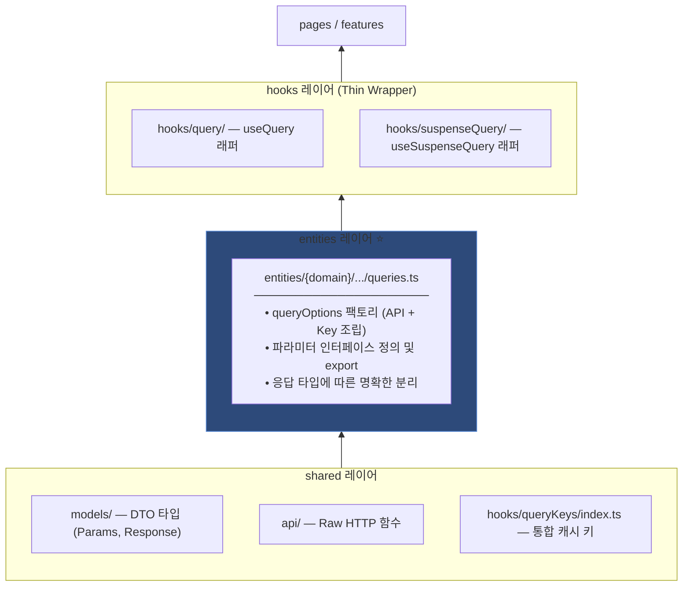

# Custom Query Hook 작성 컨벤션

> 서버 상태 데이터를 가져오는 커스텀 훅을 만들 때 따르는 레이어드 아키텍처 패턴입니다.
> FSD-lite 원칙에 기반하여, **의존성 방향은 항상 아래에서 위로(shared → entities → hooks → pages)** 흐릅니다.

---

## 1. 아키텍처 다이어그램



---

## 2. 레이어별 상세 규칙

### 2-1. Query Key Import 규칙 (Shared)
**파일 경로:** `hooks/queryKeys/index.ts`

모든 Query Key는 개별 파일이 아닌 **통합 `index.ts`를 통해 import** 합니다. 이는 프로젝트 전체에서 키 관리의 일관성을 유지하기 위함입니다.

```typescript
// ❌ BAD
import reviewKeys from '@/hooks/queryKeys/reviewKeys';

// ✅ GOOD
import { reviewKeys } from '@/hooks/queryKeys';
```

---

### 2-2. Entity 레이어: 분리 전략 (핵심 ⭐️)

응답 데이터의 구조(Response Type)에 따라 **Options 함수를 합칠지, 나눌지** 결정합니다. API 스펙상 엔드포인트와 응답 구조가 다른 경우 각각 별도의 Options 함수를 작성합니다.

#### 패턴 A: 전용 Options 함수 정의 (기본값)
대부분의 API는 각기 다른 응답 필드나 구조를 가집니다. 이 경우 무리하게 공통 함수를 만들기보다, **각 엔드포인트에 대응하는 전용 Options 함수와 Params 인터페이스**를 구성하는 것이 타입 안정성과 가독성 면에서 가장 좋습니다.

> [!IMPORTANT]
> **useQuery / useSuspenseQuery 동시 지원이 필요한 경우**
>
> 하나의 API 엔드포인트를 `useQuery`와 `useSuspenseQuery` 양쪽에서 사용해야 한다면, **팩토리 함수를 두 개로 분리**한다. 오버로딩은 구조적으로 동일한 파라미터를 TypeScript가 구분하지 못해 사용하지 않는다.
>
> - `{name}Options` — `useQuery` 전용 (`UseQueryOptions` 기반, `enabled` 포함 가능)
> - `{name}SuspenseOptions` — `useSuspenseQuery` 전용 (`UseSuspenseQueryOptions` 기반, `enabled` 없음)
>
> `queryKey`·`queryFn` 등 공유 로직은 **내부 `baseOptions` 함수**로 추출해 중복을 최소화한다.
>
> ```typescript
> // entities/display/category/queries.ts
>
> const baseOptions = (categoryNo: number) => ({
>     queryKey: categoryKeys.displaySetting(categoryNo),
>     queryFn: async () => {
>         const { data } = await category.getCategoryDisplaySettings(categoryNo);
>         return data;
>     },
> });
>
> // useQuery 전용
> export interface UseCategoryDisplaySettingQueryParams<T = GetCategoryDisplaySettings> {
>     categoryNo: number;
>     options?: Omit<UseQueryOptions<GetCategoryDisplaySettings, AxiosError, T, QueryKey>, 'queryKey' | 'queryFn'>;
> }
>
> export const categoryDisplaySettingOptions = <T>({ categoryNo, options }: UseCategoryDisplaySettingQueryParams<T>) =>
>     queryOptions({ ...baseOptions(categoryNo), ...options });
>
> // useSuspenseQuery 전용
> export interface UseCategoryDisplaySettingSuspenseParams<T = GetCategoryDisplaySettings> {
>     categoryNo: number;
>     options?: Omit<UseSuspenseQueryOptions<GetCategoryDisplaySettings, AxiosError, T, QueryKey>, 'queryKey' | 'queryFn'>;
> }
>
> export const categoryDisplaySettingSuspenseOptions = <T>({ categoryNo, options }: UseCategoryDisplaySettingSuspenseParams<T>) =>
>     queryOptions({ ...baseOptions(categoryNo), ...options });
> ```
>
> **파라미터 인터페이스 options 타입 선택 근거**
> - `UseQueryOptions`에만 있는 `enabled`가 인터섹션(`UseQueryOptions & UseSuspenseQueryOptions`)에서도 살아남기 때문에, 인터섹션으로 두 타입을 합치는 방식은 쓰지 않는다.
> - `useSuspenseQuery` 전용 인터페이스는 `UseSuspenseQueryOptions`를 직접 사용해 `enabled` 노출을 차단한다.

> [!IMPORTANT]
> **API 옵션과 React Query 옵션/파라미터의 분리 및 네이밍 규칙**
> - **쿼리 파라미터 변수명 분리**: API 함수 정의 시 쿼리 파라미터 목적의 매개변수는 `params`로 받는 반면, Custom Hooks(Entity Params)에서는 이를 **`searchParams`**라는 명칭으로 조합하여 정의하고 사용합니다. (API 호출 시 `params.searchParams` 형태로 넘겨줌)
> - **Axios 옵션 분리**: API 호출 시 전달되는 Axios 옵션은 `axiosOptions`로 명명하여 주입합니다. ([shopby/api.md #2](file:///Users/jerome/Developer/geek/ai-agent-config/conventions/shopby/api.md#L10-L22)의 `options`에 대응)
> - **React Query 옵션**: React Query 자체를 위한 옵션은 `options`로 명명하여 `queryOptions` 마지막에 전개(`...params.options`)합니다.

```typescript
// entities/display/review/queries.ts
import type { AxiosRequestConfig } from 'axios';
import type { UseQueryOptions } from '@tanstack/react-query';
import type { 
    GetProductReviewListParams, 
    GetProductReviewListResponse 
} from '@/models/display/review';

// Params 인터페이스 (옵션 격리 적용)
export interface UseProductReviewListParams<T = GetProductReviewListResponse> {
    productNo: string;
    searchParams: GetProductReviewListParams; // API DTO
    axiosOptions?: AxiosRequestConfig;         // API Axios 옵션 (shopby/api.md #2 연계)
    options?: Omit<UseQueryOptions<GetProductReviewListResponse, Error, T>, 'queryKey' | 'queryFn'>; // React Query 옵션
}

// 전용 Options
export const productReviewListOptions = <T = GetProductReviewListResponse>(
    params: UseProductReviewListParams<T>
) => queryOptions({
    queryKey: reviewKeys.list(params.productNo, params.searchParams),
    // axiosOptions를 API 함수에 직접 주입
    queryFn: () => review.getProductReviewList(params.productNo, params.searchParams, params.axiosOptions),
    ...params.options
});
```

#### 패턴 B: 내부 팩토리 함수 (응답 타입이 동일한 경우)
`banner` 처럼 `id`로 조회하든 `code`로 조회하든 **응답 데이터 구조가 동일**하다면, 내부 `createQueryFn`을 통해 로직만 분리합니다.

```typescript
// entities/banner/queries.ts

// 응답 타입이 GetBannersResponse로 동일하므로 내부에서 분기 가능
const createQueryFn = (type: 'code' | 'id', banners: string[]) => {
    return async () => {
        const { data } = type === 'code' 
            ? await banner.getBanners(banners) 
            : await banner.getBannersByIds(banners);
        return data;
    };
};
```

> [!CAUTION]
> **중요 제약사항**: `createQueryFn` 패턴은 모든 분기 케이스의 **응답 타입이 완전히 일치**할 때만 사용합니다. 응답 타입이 다르면 패턴 A(함수 분리)를 선택하세요.

---

### 2-3. Thin Wrapper Hook 작성 원칙

Entity 팩토리를 감싸는 훅은 **로직 없는 thin wrapper**여야 한다. 단, `enabled` 주입만 예외적으로 허용한다.

**useQuery 훅** (`hooks/query/...`):
- 파라미터 유효성에 의한 `enabled`를 훅 내부에서 주입하고, 호출자의 `options`를 뒤에 spread한다.
- 이렇게 하면 호출자가 `options.enabled`로 추가 제약을 AND 조건으로 걸 수 있다.

```typescript
// hooks/query/display/category/useCategoryDisplaySetting.ts
const useCategoryDisplaySetting = <T>({ categoryNo, options }: UseCategoryDisplaySettingQueryParams<T>) => {
    return useQuery(
        categoryDisplaySettingOptions({
            categoryNo,
            options: { enabled: !!categoryNo, ...options },
        }),
    );
};
```

**useSuspenseQuery 훅** (`hooks/suspenseQuery/...`):
- `enabled` 없이 팩토리를 그대로 전달한다.
- Suspense boundary가 로딩 상태를 처리하므로 `enabled`가 필요 없다.

```typescript
// hooks/suspenseQuery/display/category/useCategoryDisplaySetting.ts
const useCategoryDisplaySetting = <T>(params: UseCategoryDisplaySettingSuspenseParams<T>) => {
    return useSuspenseQuery(categoryDisplaySettingSuspenseOptions(params));
};
```

### 2-4. `enabled` 주입 위치 원칙

`enabled`는 조건의 성격에 따라 위치가 달라진다.

| 조건 유형 | 주입 위치 | 예시 |
|---|---|---|
| 파라미터 유효성 | **useQuery 훅** | `enabled: !!categoryNo` |
| 런타임 외부 상태 | **page / component** | `enabled: !isMobile && isDisplaySettingFetched` |
| suspenseQuery | **해당 없음** | Suspense boundary가 대신 처리 |

> [!CAUTION]
> **Entity 팩토리에는 `enabled`를 넣지 않는다.** 팩토리는 `useQuery`·`useSuspenseQuery` 양쪽에서 공유되는데, `useSuspenseQuery`는 `enabled`를 지원하지 않으므로 팩토리에 넣으면 일관성이 깨진다.

---

## 3. 네이밍 및 경로 규칙 요약

| 항목 | 규칙 | 예시 |
|------|------|------|
| **API 함수** | `get/post/put/delete` +PascalCase +버전(필요시)<br/>(상세 규칙은 [shopby/api.md](file:///Users/jerome/Developer/geek/ai-agent-config/conventions/shopby/api.md) 참고) | `getProductReviewList` |
| **Query Key Import** | 반드시 `@/hooks/queryKeys` 로부터 Destructuring | `import { reviewKeys } from '@/hooks/queryKeys'` |
| **Entity 함수** | 응답 타입이 다르면 각각 정의 | `xxxOptions` |
| **Entity 인터페이스** | `Use{HookName}Params<T>`<br/>(내부 API DTO 규격은 [shopby/api.md #6](file:///Users/jerome/Developer/geek/ai-agent-config/conventions/shopby/api.md#L36-L42) 준수) | `UseProductReviewListParams<T>` |
| **훅 파일명** | camelCase (케밥케이스 금지) | `useAppAccumulationAuth.ts` ✅  `use-app-accumulation-auth.ts` ❌ |

---

## 4. 체크리스트 (새 훅 추가 시)

```
[ ] queryKeys를 개별 파일이 아닌 '@/hooks/queryKeys'에서 import 했는가?
[ ] API 응답 타입이 서로 다른 경우 각각 별도의 Options 함수를 작성했는가?
[ ] useQuery / useSuspenseQuery 양쪽 지원이 필요하면 팩토리를 두 개로 분리했는가? (오버로딩 금지)
[ ] queryKey·queryFn 공유 로직은 내부 baseOptions로 추출했는가?
[ ] Entity 팩토리에 enabled를 넣지 않았는가? (enabled는 useQuery 훅 또는 page에서 주입)
[ ] Entity의 인터페이스와 Options 함수가 모두 export 되어 있는가?
[ ] 훅 레이어(Hooks)는 로직이 없는 Thin Wrapper 형태인가? (enabled 주입만 예외)
[ ] destructuring 변수명이 훅명 기반(data → {hookName}Data, isLoading → is{HookName}Loading)으로 작성되었는가?
[ ] 훅 파일명이 camelCase로 작성되었는가? (kebab-case 금지)
```

---

## 5. Destructuring 변수명 컨벤션

훅의 반환값을 destructuring할 때, **훅명에서 `use`를 제거 + 상태 접미사** 형태로 이름을 짓습니다.

```typescript
// ❌ BAD — 임의 이름
const { data: accumulationList } = useAccumulationHistoryList({ ... });
const { isLoading } = useAccumulationHistoryList({ ... });

// ✅ GOOD — 훅명 기반 이름
const {
  data: accumulationHistoryListData,
  isLoading: isAccumulationHistoryListLoading,
  isPending: isAccumulationHistoryListPending,
} = useAccumulationHistoryList({ ... });
```

| 반환 속성 | 네이밍 패턴 | 예시 |
|-----------|-------------|------|
| `data` | `{hookName}Data` | `accumulationHistoryListData` |
| `isLoading` | `is{HookName}Loading` | `isAccumulationHistoryListLoading` |
| `isPending` | `is{HookName}Pending` | `isAccumulationHistoryListPending` |
| `isError` | `is{HookName}Error` | `isAccumulationHistoryListError` |

> **규칙:** 훅명의 `use` 접두사를 제거하고 camelCase를 유지한 뒤, 상태 접미사를 붙입니다.

